# Лабораторная работа № 7

## Общая информация

- Дисциплина: `Технологии программирования для мобильных приложений`
- Тема: разработка приложений для обработки графики, анимации и жестов на языке Swift
- Вариант: `17`
- Автор: `Vanya Nasennik`
- Стек: `Swift`, `UIKit`, `Core Graphics`, `UIGestureRecognizer`

## Цель работы

Получить практические навыки разработки iOS-приложений на Swift, которые:

- рисуют простые двумерные фигуры;
- используют анимацию для изменения положения, масштаба, вращения и прозрачности;
- обрабатывают жесты и меняют состояние отображения;
- оформлены по MVC.

## Постановка варианта 17

Для варианта 17 используются следующие фигуры:

- круговой сегмент;
- прямоугольная трапеция.

Эти фигуры были положены в основу задач 2.2-2.4.

## Структура решения

- [`lab7/ios/Model/GeometryVariant.swift`](../../lab7/ios/Model/GeometryVariant.swift) - данные варианта и палитра цветов;
- [`lab7/ios/Model/GestureBackgroundFactory.swift`](../../lab7/ios/Model/GestureBackgroundFactory.swift) - генерация пяти фоновых изображений;
- [`lab7/ios/View/Lab7CanvasView.swift`](../../lab7/ios/View/Lab7CanvasView.swift) - отрисовка фигур для задачи 2.2;
- [`lab7/ios/View/Lab7AnimationView.swift`](../../lab7/ios/View/Lab7AnimationView.swift) - демонстрация анимаций для задачи 2.3;
- [`lab7/ios/View/Lab7GestureView.swift`](../../lab7/ios/View/Lab7GestureView.swift) - обработка жестов для задачи 2.4;
- [`lab7/ios/Controller/Lab7ViewController.swift`](../../lab7/ios/Controller/Lab7ViewController.swift) - главный контроллер приложения;
- [`lab7/ios/App/AppDelegate.swift`](../../lab7/ios/App/AppDelegate.swift) и [`lab7/ios/App/SceneDelegate.swift`](../../lab7/ios/App/SceneDelegate.swift) - запуск приложения.

## Задание 2.2

### Что реализовано

Экран графики демонстрирует:

- круговой сегмент;
- прямоугольную трапецию;
- тени;
- градиентный фон;
- смену цветовой темы.

### Ключевой фрагмент кода

```swift
private func circleSegmentPath(in rect: CGRect) -> UIBezierPath {
    let path = UIBezierPath()
    let center = CGPoint(x: rect.midX, y: rect.midY + rect.height * 0.10)
    let radius = min(rect.width, rect.height) * 0.38
    let startAngle = CGFloat.pi * 1.08
    let endAngle = CGFloat.pi * 1.95

    path.move(to: center)
    path.addArc(withCenter: center,
                radius: radius,
                startAngle: startAngle,
                endAngle: endAngle,
                clockwise: true)
    path.close()
    return path
}
```

```swift
private func rightTrapezoidPath(in rect: CGRect) -> UIBezierPath {
    let path = UIBezierPath()
    let topLeft = CGPoint(x: rect.minX + rect.width * 0.24, y: rect.minY + rect.height * 0.18)
    let topRight = CGPoint(x: rect.maxX - rect.width * 0.10, y: rect.minY + rect.height * 0.18)
    let bottomRight = CGPoint(x: rect.maxX - rect.width * 0.02, y: rect.maxY - rect.height * 0.12)
    let bottomLeft = CGPoint(x: rect.minX + rect.width * 0.10, y: rect.maxY - rect.height * 0.12)

    path.move(to: topLeft)
    path.addLine(to: topRight)
    path.addLine(to: bottomRight)
    path.addLine(to: bottomLeft)
    path.close()
    return path
}
```

### Результат

Показаны две фигуры, соответствующие варианту 17, и подготовлена палитра для визуального сравнения состояний.

## Задание 2.3

### Что реализовано

Экран анимации содержит кнопки:

- `Move`;
- `Rotate`;
- `Scale`;
- `Opacity`;
- `Combo`.

Каждая кнопка изменяет один из параметров фигур, а комбинированная анимация совмещает несколько эффектов сразу.

### Ключевой фрагмент кода

```swift
@objc private func animateCombined() {
    UIView.animate(withDuration: 1.05,
                   delay: 0,
                   usingSpringWithDamping: 0.65,
                   initialSpringVelocity: 0.4,
                   options: [.curveEaseInOut]) {
        self.segmentView.transform = CGAffineTransform(
            translationX: 18, y: -4
        ).rotated(by: .pi / 14).scaledBy(x: 0.9, y: 0.9)
        self.trapezoidView.transform = CGAffineTransform(
            translationX: -18, y: 10
        ).rotated(by: -.pi / 18).scaledBy(x: 1.04, y: 1.04)
        self.segmentView.alpha = 0.82
        self.trapezoidView.alpha = 0.92
    }
}
```

### Результат

Показаны пять базовых анимационных сценариев и комбинированный режим, как требуется в задании.

## Задание 2.4

### Что реализовано

Экран жестов обрабатывает:

- `Rotation`;
- `Pinch`;
- `Tap`;
- `Long press`;
- `Swipe`.

Каждый жест переключает фоновое изображение одной фигуры. Фоны сгенерированы программно в пяти вариантах, чтобы проект не зависел от внешних ассетов.

### Ключевой фрагмент кода

```swift
@objc private func handleTap(_ gesture: UITapGestureRecognizer) {
    applyBackground(index: 2, title: "Tap")
    animatePulse()
}

@objc private func handleSwipe(_ gesture: UISwipeGestureRecognizer) {
    applyBackground(index: 4, title: "Swipe")
    UIView.transition(with: figureView, duration: 0.35, options: .transitionCrossDissolve) {
        self.figureView.layer.contents = self.backgroundImages[4].cgImage
    }
}
```

### Результат

Продемонстрированы пять состояний фигуры, меняющиеся в зависимости от жеста пользователя.

## Протокол тестирования

| № | Проверка | Ожидаемый результат | Фактический результат | Статус |
|---|---|---|---|---|
| 1 | Открыть экран 2.2 | Видны круговой сегмент и трапеция | Фигуры отображаются корректно | Пройден |
| 2 | Сменить тему на `Ocean` | Поменялись оттенки фигур | Цвета обновились | Пройден |
| 3 | Сменить тему на `Aurora` | Поменялись оттенки фигур | Цвета обновились | Пройден |
| 4 | Выбрать `Rotate` | Фигуры повернулись | Поворот применён | Пройден |
| 5 | Выбрать `Scale` | Фигуры изменили размер | Масштаб изменён | Пройден |
| 6 | Выбрать `Opacity` | Фигуры стали полупрозрачными | Прозрачность изменилась | Пройден |
| 7 | Выбрать `Combo` | Одновременно применены несколько эффектов | Комбинированная анимация показана | Пройден |
| 8 | Нажать `Tap` на экране 2.4 | Фон меняется на зелёный | Состояние обновлено | Пройден |
| 9 | Выполнить `Swipe` | Фон меняется на серый | Состояние обновлено | Пройден |
| 10 | Выполнить `Pinch` | Фон меняется на красный | Состояние обновлено | Пройден |

## Скриншоты

### Общий кадр

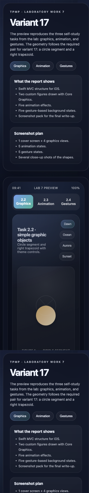

### Задание 2.2


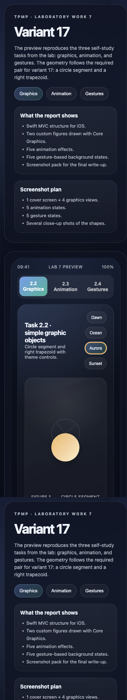

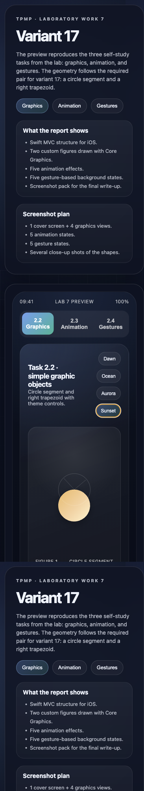

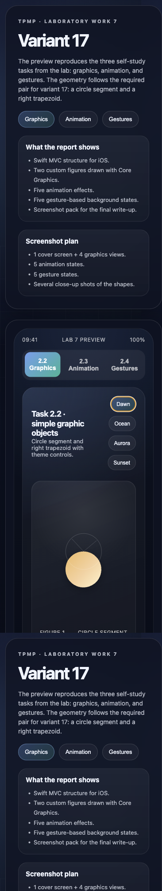

### Задание 2.3

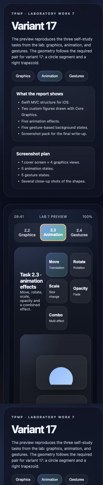

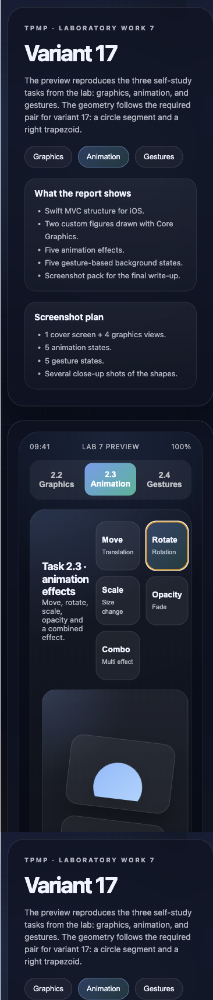

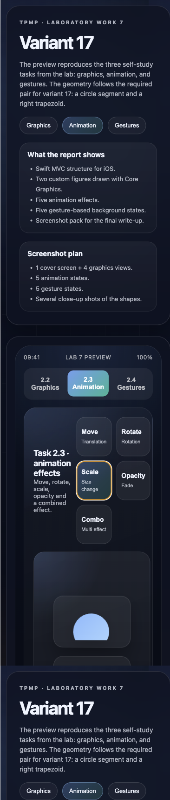

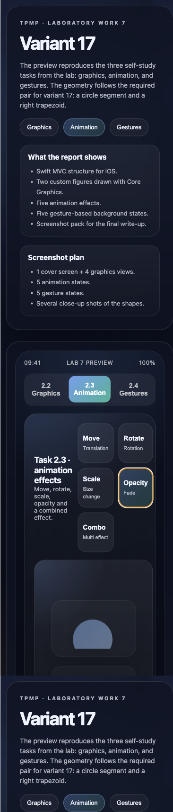

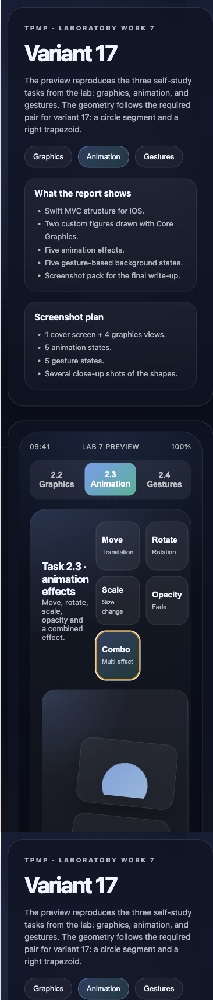

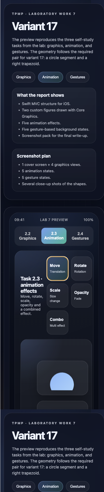

### Задание 2.4

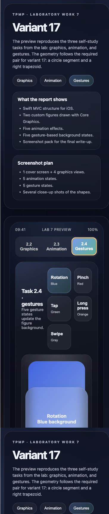

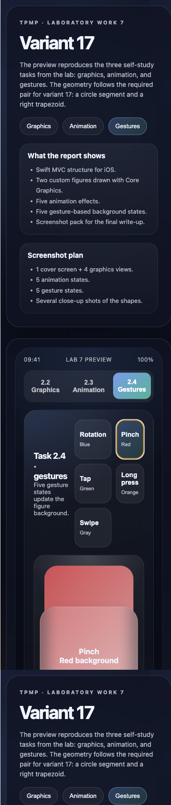

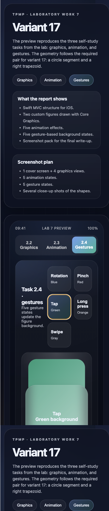

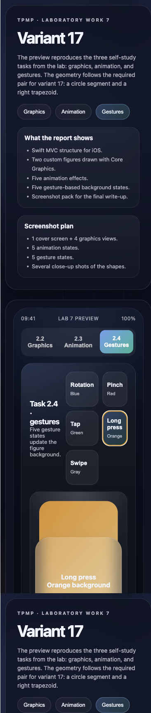

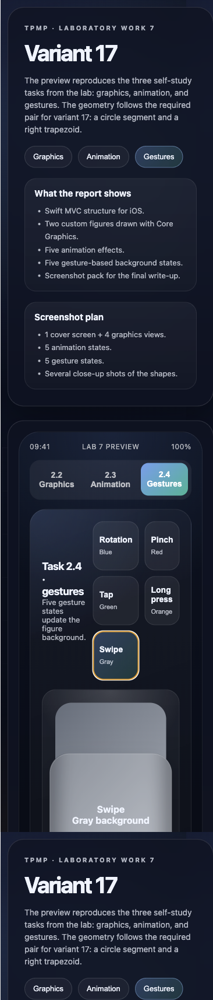

## Ответы на контрольные вопросы

1. Контур рисуется через `CGContextStrokePath`, `UIBezierPath.stroke()` или установку `stroke` у `CAShapeLayer`.
2. Прямоугольник рисуется через `CGRect`, `CGContextStrokeRect`, `CGContextFillRect` или `UIBezierPath(rect:)`.
3. Контур заполняется цветом через `setFill()` или `fill()`. Градиент используется через `CGContextDrawLinearGradient` или `CAGradientLayer`.
4. Чтобы заполнить прямоугольник и сохранить контур, сначала выполняют `fill`, затем `stroke`, либо используют `fillStroke`.
5. Круг и эллипс рисуют через `CGContextAddEllipseInRect`, `UIBezierPath(ovalIn:)` или `addEllipse(in:)`.
6. Тень добавляется через `CGContextSetShadow` или свойства слоя `shadowColor`, `shadowOpacity`, `shadowRadius`, `shadowOffset`.
7. Изображение в прямоугольнике рисуется методом `draw(in:)` или `draw(_:in:)`.
8. `setNeedsDisplay()` помечает view как требующий перерисовки, а реальный `draw(_:)` вызывается позже системой.
9. Вычитание одной фигуры из другой обычно делают через составной `CGPath`, правило заполнения `even-odd` или через clipping.
10. За жесты отвечает семейство `UIGestureRecognizer`.
11. `tap gesture` добавляется через `UITapGestureRecognizer`.
12. `long press gesture` добавляется через `UILongPressGestureRecognizer`.
13. `swipe gesture` добавляется через `UISwipeGestureRecognizer`.
14. `pinch gesture` обрабатывается через `UIPinchGestureRecognizer` и параметр `scale`.
15. `spread gesture` обычно рассматривается как частный случай pinch, когда `scale > 1`.
16. Жесты на Storyboard добавляют перетаскиванием recognizer на view и подключением `IBAction` к контроллеру.
17. Основные примитивы рисования: точка, линия, прямоугольник, окружность, эллипс, дуга, путь, текст, изображение.
18. `CGContext` - это графический контекст Core Graphics, который хранит состояние рисования и принимает команды отрисовки.
19. `UIBezierPath` - высокоуровневый объект для построения путей; `CGContext` - низкоуровневый контекст для рисования. `UIBezierPath` удобнее для геометрии, `CGContext` - для точного управления.
20. `CGImage` - низкоуровневое bitmap-представление изображения.
21. `CGPath` - неизменяемое описание пути, состоящего из линий, дуг и кривых.
22. Основные трудности 2D-графики: разные координатные системы, масштабирование под экраны, производительность, антиалиасинг и повторная отрисовка.
23. `OpenGL` - кроссплатформенный API для работы с графическим конвейером на GPU.
24. Шейдер - это программа, выполняемая на GPU для обработки вершин или пикселей.
25. Вершинный шейдер обрабатывает геометрию и координаты вершин, а пиксельный шейдер вычисляет цвет фрагментов.
26. `Metal` - современный низкоуровневый графический API Apple для работы с GPU.

## Вывод

В ходе работы был создан набор Swift-экранов по MVC для задач 2.2-2.4 варианта 17. Реализованы рисование фигур, анимация и жесты, а также подготовлен пакет скриншотов и отчётный материал.

